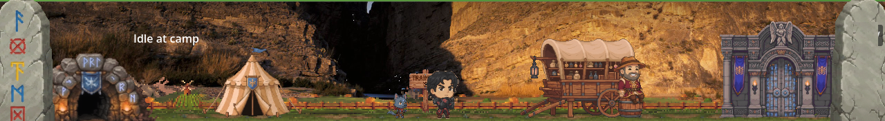

# Angel Valle Jr.

I build and ship production software by directing AI coding agents through the full task lifecycle: writing the spec, reviewing the implementation, testing the result, and owning every line that ships. CS student at Western Governors University, B.S. expected August 2027. San Francisco.

Before software I spent ten years in hospitality operations. The last stretch of that included POS rollouts where I worked the software backend alongside vendor technicians, then trained the whole front-of-house team on the new system. Shipping on a deadline and teaching people to use what shipped are old habits from that job.

## Pocket Adventurer: Desktop Hero

A commercial desktop idle RPG I'm building solo in Godot 4. A tiny hero camps at the bottom of your screen, trains, runs auto-combat dungeons, and eventually retires into a Hall of Heroes. The demo targets Steam Next Fest in October 2026.

The source is closed, which is standard for a commercial game. The store page, devlog, and gameplay footage will be linked here as they go live. What I can show today is the production tooling I built around it:

- [markdown-task-dashboard](https://github.com/avjcodes/markdown-task-dashboard) is the tracker I run the game with, published as a template. Python standard library only. It reads plain markdown task notes and turns them into a countdown clock: hours of work remaining, projected finish date at my measured pace, and how that lands against the Next Fest date. I look at it every day, which is more than I can say for most trackers I've tried.
- [sprite-chroma-key](https://github.com/avjcodes/sprite-chroma-key) removes green or magenta screens from sprite sheets when the background color drifts from frame to frame, which AI video generation does constantly. It measures the actual background of every frame instead of trusting the color you asked for.

There is more tooling that stays private because it lives inside my notes: an Obsidian second brain wired into my agent workflow, with session hooks, semantic search over the vault, and code knowledge graphs. Every work session starts there.

## Contact

theangelvallejr@gmail.com
